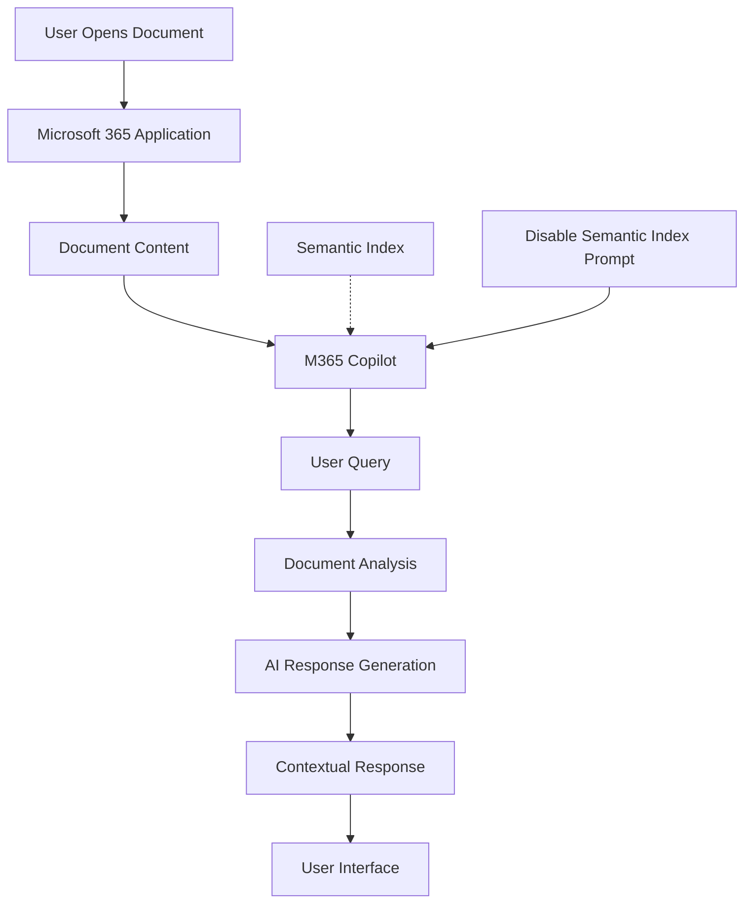

# Chat with a Document using Microsoft 365 Copilot

## Introduction

This document provides comprehensive guidance for implementing document interaction capabilities using Microsoft 365 Copilot. This no-code solution enables users to have natural language conversations with individual documents directly within the Microsoft 365 ecosystem, leveraging the power of AI without requiring any technical configuration.

## Solution Overview

Microsoft 365 Copilot provides native document interaction capabilities that allow users to query, summarize, and analyze individual documents through natural language conversations. This solution operates within the existing Microsoft 365 environment and requires no additional setup or configuration.

### Business Value

- **Zero Implementation Cost**: No additional licensing or setup required beyond M365 Copilot
- **Immediate Availability**: Ready to use within existing Microsoft 365 applications
- **Enhanced Productivity**: Quickly extract insights from lengthy documents
- **Seamless Integration**: Works natively within Word, PowerPoint, Excel, and other M365 apps
- **Security Compliance**: Inherits all existing Microsoft 365 security and compliance controls
- **User Adoption**: Familiar interface reduces training requirements

## Data Flow



1. User opens document in Microsoft 365 application
2. M365 Copilot analyzes document content
3. User submits natural language query about the document
4. Copilot processes query against document content (with semantic index disabled per prompt)
5. AI generates response based solely on document content
6. Contextual response is presented within the application interface

## Configuration Instructions

### Prerequisites

- Microsoft 365 E3/E5 subscription with Copilot licensing
- Access to Microsoft 365 applications (Word, PowerPoint, Excel, Teams)
- Documents stored in OneDrive for Business or SharePoint Online
- User account with appropriate permissions to access documents

### Step 1: Enable Microsoft 365 Copilot

1. **Verify Copilot Availability**
   - Ensure M365 Copilot licenses are assigned to users
   - Confirm Copilot features are enabled in tenant settings
   - Verify users have completed required compliance training

2. **Access Copilot in Applications**
   - Open Word, PowerPoint, or Excel online or desktop applications
   - Look for Copilot icon in the ribbon or sidebar
   - Ensure Copilot features are visible and accessible

### Step 2: Document Preparation

1. **Document Storage Requirements**
   - Store documents in OneDrive for Business or SharePoint Online
   - Ensure documents are saved in supported formats:
     - **Word**: .docx, .doc
     - **PowerPoint**: .pptx, .ppt
     - **Excel**: .xlsx, .xls
     - **PDF**: .pdf (with limitations)

2. **Document Access Permissions**
   - Verify user has read/write access to target documents
   - Ensure sharing permissions are appropriate for intended use
   - Consider document sensitivity and classification requirements

### Step 3: Using Copilot with Documents in Word

1. **Open Document in Word**
   - Navigate to OneDrive or SharePoint
   - Open target document in Word Online or Word Desktop
   - Ensure document content is fully loaded

2. **Access Copilot Features**
   - Click the Copilot icon in the ribbon
   - Select "Chat with Copilot" option
   - Copilot panel will open on the right side of the screen

3. **Disable Semantic Index (Critical)**
   ```
   Initial Prompt Template:
   "Please analyze only the content of this specific document. Do not use any external knowledge or semantic index from other documents. Base your responses solely on what is written in this document. If information is not present in this document, please clearly state that."
   ```

4. **Document Interaction Examples**
   ```
   Query Examples:
   - "Summarize the main points of this document"
   - "What are the key recommendations mentioned?"
   - "Find all instances where [specific term] is mentioned"
   - "Extract the action items from this document"
   - "What is the conclusion of this document?"
   - "Create a bullet point summary of each section"
   ```

### Step 4: Using Copilot with Presentations in PowerPoint

1. **Open Presentation**
   - Access PowerPoint Online or Desktop application
   - Open target presentation from OneDrive/SharePoint
   - Ensure all slides are loaded and accessible

2. **Copilot Interaction**
   - Click Copilot icon in PowerPoint ribbon
   - Use the semantic index disabling prompt as shown above
   - Interact with presentation content:
     ```
     PowerPoint-Specific Queries:
     - "Summarize each slide in this presentation"
     - "What are the key messages across all slides?"
     - "Find slides that mention [specific topic]"
     - "Extract all data points from charts and graphs"
     - "What is the flow of information in this presentation?"
     ```

### Step 5: Using Copilot with Spreadsheets in Excel

1. **Open Workbook**
   - Launch Excel Online or Desktop
   - Open target workbook containing data
   - Ensure all worksheets are accessible

2. **Excel Copilot Interaction**
   - Access Copilot through Excel ribbon
   - Apply semantic index disabling prompt
   - Query spreadsheet data:
     ```
     Excel-Specific Queries:
     - "Analyze the data in this spreadsheet"
     - "What trends do you see in the data?"
     - "Calculate the total for column [X]"
     - "Find the highest/lowest values in this dataset"
     - "Explain what this data represents"
     ```

### Step 6: Advanced Document Interaction Techniques

1. **Focused Analysis Queries**
   ```
   Targeted Prompts:
   - "Focus only on section [X] and summarize its contents"
   - "Compare the information in pages [Y] and [Z]"
   - "Extract all dates and deadlines mentioned in this document"
   - "List all people, organizations, or companies mentioned"
   - "Find all financial figures or numerical data"
   ```

2. **Content Transformation Requests**
   ```
   Transformation Examples:
   - "Convert the main points into a checklist format"
   - "Create a timeline based on the events described"
   - "Organize the information into categories"
   - "Generate questions that this document answers"
   - "Create an executive summary of this document"
   ```

### Step 7: Best Practices for Document Chat

1. **Query Formulation**
   - Be specific about what information you're seeking
   - Use clear, direct language in your questions
   - Reference specific sections or pages when relevant
   - Ask follow-up questions to drill down into details

2. **Semantic Index Management**
   - Always start sessions with the semantic index disabling prompt
   - Remind Copilot to focus on document content if responses seem too broad
   - Verify that responses are based on document content, not external knowledge

3. **Response Validation**
   - Cross-reference Copilot responses with actual document content
   - Look for page numbers or section references in responses
   - Ask for specific citations when needed: "Where in the document does it mention this?"

### Step 8: Troubleshooting Common Issues

1. **Copilot Not Available**
   - Verify Copilot licensing is active
   - Check that document is stored in OneDrive/SharePoint
   - Ensure latest version of Office applications
   - Clear browser cache if using web applications

2. **Responses Include External Information**
   - Restate the semantic index disabling prompt
   - Be more explicit: "Answer based only on this document's content"
   - Ask for specific page or section references in responses

3. **Limited Response Quality**
   - Ensure document text is selectable (not image-based)
   - Check document formatting for accessibility
   - Try rephrasing questions in different ways
   - Break complex queries into smaller, specific questions

### Step 9: Integration with Teams and Collaboration

1. **Sharing Insights**
   - Copy Copilot responses to share with team members
   - Use @mentions to reference specific team members
   - Create follow-up documents based on Copilot analysis

2. **Collaborative Document Review**
   ```
   Team Collaboration Prompts:
   - "What questions would a new team member have about this document?"
   - "What are the most important points for [specific role/department]?"
   - "Create a discussion agenda based on this document"
   - "What actions items should we track from this document?"
   ```

### Step 10: Compliance and Security Considerations

1. **Data Handling**
   - Understand that Copilot processes document content through Microsoft's AI services
   - Ensure compliance with organizational data handling policies
   - Consider document classification levels when using Copilot

2. **Audit and Monitoring**
   - Monitor Copilot usage through Microsoft 365 admin center
   - Review audit logs for document access and AI interactions
   - Ensure usage aligns with organizational AI usage policies

## Glossary

- **Microsoft 365 Copilot**: AI-powered assistant integrated into Microsoft 365 applications
- **Semantic Index**: Microsoft's knowledge graph that connects information across documents and applications
- **OneDrive for Business**: Cloud storage service for individual users within organizations
- **SharePoint Online**: Collaborative platform for document management and sharing
- **Document Classification**: System for categorizing documents based on sensitivity and compliance requirements
- **Query**: Natural language question or request submitted to Copilot
- **Context Window**: The amount of document content Copilot can process in a single interaction

## References

- [Microsoft 365 Copilot Documentation](https://docs.microsoft.com/en-us/microsoft-365-copilot/)
- [Microsoft 365 Admin Center](https://admin.microsoft.com/)
- [OneDrive for Business Documentation](https://docs.microsoft.com/en-us/onedrive/)
- [SharePoint Online Documentation](https://docs.microsoft.com/en-us/sharepoint/)
- [Microsoft 365 Compliance Center](https://compliance.microsoft.com/)
- [AI and Machine Learning in Microsoft 365](https://docs.microsoft.com/en-us/microsoft-365/ai/)
