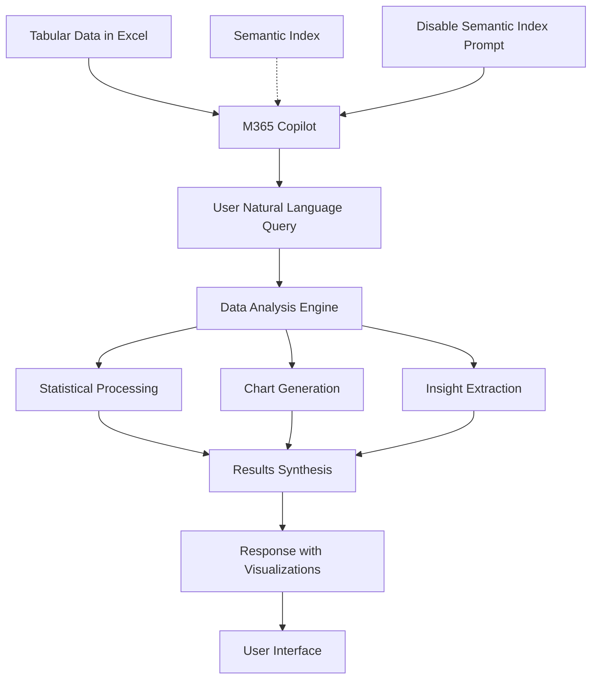

# Chat with Tabular Data using Microsoft 365 Copilot

## Introduction

This document provides comprehensive guidance for implementing tabular data interaction capabilities using Microsoft 365 Copilot. This no-code solution enables users to have natural language conversations with spreadsheet data, generate insights, create visualizations, and perform data analysis directly within Excel using AI-powered assistance.

## Solution Overview

Microsoft 365 Copilot in Excel provides native capabilities for interacting with tabular data through natural language queries. Users can analyze data, generate charts, create summaries, and extract insights without requiring advanced Excel skills or external tools. The solution operates within the existing Microsoft 365 environment with seamless integration.

### Business Value

- **Democratized Data Analysis**: Enable non-technical users to perform complex data analysis
- **Rapid Insight Generation**: Quickly identify trends, patterns, and outliers in datasets
- **Automated Visualization**: Generate charts and graphs through natural language prompts
- **Enhanced Decision Making**: Transform raw data into actionable business insights
- **Reduced Analysis Time**: Accomplish in minutes what traditionally took hours
- **No Additional Training**: Leverage familiar Excel interface with AI enhancement

## Data Flow



1. User opens Excel workbook containing tabular data
2. M365 Copilot analyzes data structure and content
3. User submits natural language query about the data
4. Copilot processes query focusing only on workbook data (semantic index disabled)
5. AI performs statistical analysis, generates charts, or extracts insights
6. Results are presented with appropriate visualizations and explanations

## Configuration Instructions

### Prerequisites

- Microsoft 365 E3/E5 subscription with Copilot for Excel licensing
- Excel Online or Excel Desktop application access
- Tabular data stored in Excel workbooks
- Data stored in OneDrive for Business or SharePoint Online
- User permissions to access and modify target workbooks

### Step 1: Data Preparation

1. **Data Structure Requirements**
   - Organize data in proper table format with headers
   - Ensure each column has a descriptive header
   - Remove empty rows and columns from data range
   - Format data consistently within columns

2. **Recommended Data Formats**
   ```
   Data Structure Example:
   | Date       | Product    | Region    | Sales    | Quantity | Rep Name    |
   |------------|------------|-----------|----------|----------|-------------|
   | 2024-01-15 | Product A  | North     | $15,000  | 150      | John Smith  |
   | 2024-01-16 | Product B  | South     | $8,500   | 85       | Jane Doe    |
   | 2024-01-17 | Product A  | East      | $12,000  | 120      | Bob Wilson  |
   ```

3. **Data Quality Checklist**
   - Consistent date formats across date columns
   - Numerical data properly formatted (remove text from number columns)
   - No merged cells in data range
   - Clear, descriptive column headers
   - Consistent categorical values (avoid variations like "North" vs "NORTH")

### Step 2: Excel Copilot Setup

1. **Access Excel with Copilot**
   - Open Excel Online or Excel Desktop
   - Navigate to workbook stored in OneDrive/SharePoint
   - Ensure Copilot icon is visible in the ribbon
   - Verify data is loaded and accessible

2. **Enable Copilot for Data Analysis**
   - Click the Copilot icon in Excel ribbon
   - Select "Analyze data" or "Chat with Copilot" option
   - Copilot panel will open showing data analysis options

### Step 3: Initial Data Interaction

1. **Disable Semantic Index (Critical)**
   ```
   Initial Prompt Template:
   "Please analyze only the data in this Excel workbook. Do not use any external knowledge or semantic index from other sources. Base your analysis solely on the data present in this spreadsheet. If information is not available in this data, please clearly state that."
   ```

2. **Basic Data Exploration**
   ```
   Exploratory Prompts:
   - "Describe the structure of this data"
   - "What columns are available in this dataset?"
   - "How many rows of data do we have?"
   - "What is the date range covered by this data?"
   - "Identify any missing or blank values"
   ```

### Step 4: Data Analysis Queries

1. **Statistical Analysis**
   ```
   Statistical Query Examples:
   - "Calculate the average sales by region"
   - "What is the total quantity sold for each product?"
   - "Show me the minimum and maximum sales values"
   - "Calculate the standard deviation of sales data"
   - "What is the median sales figure by month?"
   ```

2. **Trend Analysis**
   ```
   Trend Query Examples:
   - "Show sales trends over time"
   - "Which products have increasing sales trends?"
   - "Identify seasonal patterns in the data"
   - "Compare performance between different time periods"
   - "What are the fastest-growing product categories?"
   ```

3. **Comparative Analysis**
   ```
   Comparison Query Examples:
   - "Compare sales performance between regions"
   - "Which sales representative has the highest performance?"
   - "How do product sales compare to each other?"
   - "Show the difference between Q1 and Q2 performance"
   - "Rank products by total revenue"
   ```

### Step 5: Chart and Visualization Generation

1. **Basic Chart Creation**
   ```
   Chart Generation Prompts:
   - "Create a bar chart showing sales by product"
   - "Generate a line chart of sales trends over time"
   - "Make a pie chart showing market share by region"
   - "Create a scatter plot of quantity vs. sales amount"
   - "Generate a column chart comparing monthly performance"
   ```

2. **Advanced Visualization Requests**
   ```
   Advanced Chart Prompts:
   - "Create a combination chart showing sales volume and revenue"
   - "Generate a heatmap showing performance by region and product"
   - "Make a waterfall chart showing contribution to total sales"
   - "Create a dashboard with multiple charts showing key metrics"
   - "Generate a treemap visualization of sales by category"
   ```

3. **Chart Customization**
   ```
   Customization Requests:
   - "Change the chart colors to match our brand colors"
   - "Add data labels to the chart"
   - "Include a trend line in the chart"
   - "Modify the chart title and axis labels"
   - "Create a professional-looking chart for presentation"
   ```

### Step 6: Advanced Data Insights

1. **Pattern Recognition**
   ```
   Pattern Analysis Prompts:
   - "Identify unusual patterns or outliers in the data"
   - "What factors correlate with higher sales?"
   - "Find products that perform well together"
   - "Identify underperforming segments"
   - "Detect any anomalies in the sales data"
   ```

2. **Predictive Insights**
   ```
   Forecasting Prompts:
   - "Based on current trends, what do you predict for next quarter?"
   - "Which products are likely to grow in the coming months?"
   - "Identify potential risks based on the data patterns"
   - "What seasonal adjustments should we consider?"
   - "Project sales if current trends continue"
   ```

### Step 7: Business Intelligence Queries

1. **Performance Metrics**
   ```
   KPI Analysis Prompts:
   - "Calculate key performance indicators from this data"
   - "What is our top-performing region and why?"
   - "Identify our most profitable products"
   - "Calculate sales conversion rates"
   - "Show performance against targets or goals"
   ```

2. **Strategic Insights**
   ```
   Strategic Analysis Prompts:
   - "What recommendations can you make based on this data?"
   - "Where should we focus our sales efforts?"
   - "What opportunities do you see in the data?"
   - "Identify areas needing improvement"
   - "Suggest data-driven strategies for growth"
   ```

### Step 8: Creating Automated Reports

1. **Summary Generation**
   ```
   Report Generation Prompts:
   - "Create an executive summary of this data"
   - "Generate a monthly performance report"
   - "Summarize key findings and insights"
   - "Create a dashboard summary for leadership"
   - "Generate actionable insights from this analysis"
   ```

2. **Data Storytelling**
   ```
   Narrative Prompts:
   - "Tell the story that this data reveals"
   - "Explain the business implications of these trends"
   - "Create a narrative around our performance data"
   - "Describe what happened and why it matters"
   - "Connect the data insights to business outcomes"
   ```

### Step 9: Collaborative Data Analysis

1. **Team Sharing**
   - Export Copilot-generated charts and insights
   - Share workbooks with embedded analysis
   - Create presentation-ready visualizations
   - Document analytical findings for team review

2. **Cross-Functional Insights**
   ```
   Departmental Analysis Prompts:
   - "What insights are most relevant for the marketing team?"
   - "Generate sales insights for the finance department"
   - "Create operational insights from this data"
   - "What should the leadership team focus on?"
   - "Provide customer-focused insights from this sales data"
   ```

### Step 10: Data Quality and Validation

1. **Data Verification**
   ```
   Quality Check Prompts:
   - "Check for data inconsistencies or errors"
   - "Validate that calculations are correct"
   - "Identify missing or incomplete data"
   - "Verify data relationships make business sense"
   - "Check for duplicate records or values"
   ```

2. **Analysis Validation**
   - Cross-check AI-generated insights with manual analysis
   - Verify chart accuracy against source data
   - Confirm that conclusions align with business knowledge
   - Test different query approaches for consistency

### Step 11: Best Practices for Data Chat

1. **Query Optimization**
   - Start with broad questions, then drill down into specifics
   - Use consistent terminology that matches your column headers
   - Be specific about time periods, regions, or categories of interest
   - Ask follow-up questions to explore insights deeper

2. **Chart and Visualization Best Practices**
   - Request appropriate chart types for your data relationships
   - Ask for clear titles and labels on all charts
   - Consider your audience when requesting chart styles
   - Test different visualization approaches for the same data

3. **Data Interpretation Guidelines**
   - Always validate AI insights against business knowledge
   - Consider external factors that may not be in the data
   - Ask for confidence levels on predictions and forecasts
   - Seek clarification when insights seem unexpected

## Glossary

- **Tabular Data**: Structured data organized in rows and columns format
- **Microsoft 365 Copilot**: AI assistant integrated into Microsoft 365 applications
- **Data Analysis**: Process of examining data to extract meaningful insights
- **Visualization**: Graphical representation of data through charts and graphs
- **KPI (Key Performance Indicator)**: Measurable values that demonstrate performance effectiveness
- **Trend Analysis**: Examination of data patterns over time
- **Outlier**: Data point that differs significantly from other observations
- **Correlation**: Statistical relationship between two or more variables

## References

- [Microsoft 365 Copilot in Excel Documentation](https://docs.microsoft.com/en-us/microsoft-365-copilot/excel)
- [Excel Data Analysis Tools](https://docs.microsoft.com/en-us/office/client-developer/excel/excel-home)
- [Power BI Integration with Excel](https://docs.microsoft.com/en-us/power-bi/connect-data/service-excel-workbook-files)
- [Microsoft 365 Admin Center](https://admin.microsoft.com/)
- [Data Visualization Best Practices](https://docs.microsoft.com/en-us/power-bi/guidance/report-design-tips-charts)
- [Excel Functions and Formulas](https://docs.microsoft.com/en-us/office/client-developer/excel/excel-recalc-engine)
