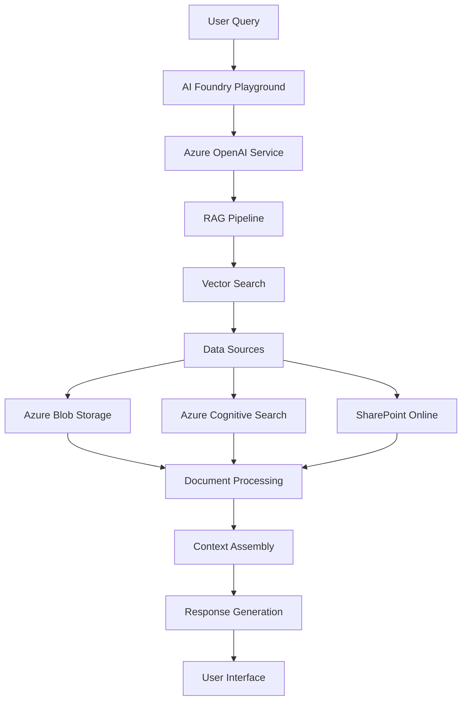

# Chat with Your Data using Azure AI Foundry Agent Playground

## Introduction

This document provides comprehensive guidance for implementing a chat-with-your-data solution using Azure AI Foundry Agent Playground. This low-code approach leverages Azure's advanced AI capabilities to create intelligent conversational experiences that can interact with organizational data through a user-friendly playground environment.

## Solution Overview

Azure AI Foundry Agent Playground is a low-code platform that enables users to rapidly prototype, test, and deploy AI agents capable of reasoning over custom data sources. The solution provides a visual interface for configuring AI agents without extensive programming knowledge while maintaining enterprise-grade security and scalability.

### Business Value

- **Rapid Prototyping**: Create and test AI agents in minutes using intuitive playground interface
- **Enterprise Security**: Built-in security controls and compliance with organizational policies
- **Advanced AI Capabilities**: Access to latest Azure OpenAI models and reasoning capabilities
- **Flexible Data Integration**: Support for multiple data formats and sources
- **Cost Optimization**: Pay-per-use model with transparent pricing for AI operations
- **Seamless Deployment**: Direct path from prototype to production deployment

## Data Flow



1. User submits query through the playground interface
2. Query is processed by Azure OpenAI models configured in the agent
3. RAG (Retrieval-Augmented Generation) pipeline searches relevant data
4. Vector search identifies most relevant content from indexed sources
5. Retrieved context is assembled and provided to the AI model
6. Model generates response combining retrieved data with AI reasoning
7. Response is presented to user with source citations

## Configuration Instructions

### Prerequisites

- Azure subscription with appropriate permissions
- Azure AI Foundry access (formerly Azure Machine Learning Studio)
- Azure OpenAI Service deployment
- Data sources prepared for indexing
- Contributor or Owner role on target resource group

### Step 1: Azure AI Foundry Setup

1. **Access Azure AI Foundry**
   - Navigate to [https://ai.azure.com](https://ai.azure.com)
   - Sign in with Azure credentials
   - Ensure you have access to target subscription

2. **Create AI Hub**
   ```
   Resource Details:
   - Hub name: [organization]-ai-hub
   - Subscription: [target subscription]
   - Resource group: [existing or new RG]
   - Location: East US 2 or West Europe (recommended)
   - Storage account: Auto-create or select existing
   - Key vault: Auto-create or select existing
   ```

3. **Configure Compute Resources**
   - Select appropriate compute tier for workload
   - Enable auto-scaling if expected variable usage
   - Configure idle shutdown to optimize costs

### Step 2: Data Preparation and Indexing

1. **Prepare Data Sources**
   - **Supported Formats**: PDF, Word, Excel, PowerPoint, HTML, Markdown, Plain Text
   - **Data Location Options**:
     - Azure Blob Storage (recommended)
     - SharePoint Online
     - OneDrive for Business
     - Local file upload (for testing)

2. **Upload Data to Azure Blob Storage**
   ```powershell
   # Create storage account if needed
   az storage account create --name [storageaccountname] --resource-group [rgname] --location eastus2 --sku Standard_LRS
   
   # Create container for documents
   az storage container create --name documents --account-name [storageaccountname]
   
   # Upload documents
   az storage blob upload-batch --destination documents --source [local-folder-path] --account-name [storageaccountname]
   ```

3. **Configure Azure Cognitive Search**
   ```
   Search Service Configuration:
   - Service name: [organization]-search-service
   - Pricing tier: Standard (recommended for production)
   - Replica count: 1 (increase for high availability)
   - Partition count: 1 (increase for large datasets)
   - Semantic search: Enabled (for better relevance)
   ```

### Step 3: Agent Configuration in Playground

1. **Create New Agent**
   - Navigate to "Agent Playground" in Azure AI Foundry
   - Click "Create new agent"
   - Select "Chat with your data" template
   - Provide agent name: `[Organization] Data Assistant`

2. **Configure AI Model**
   ```
   Model Settings:
   - Model: GPT-4 (latest version available)
   - Deployment: Select existing Azure OpenAI deployment
   - Temperature: 0.3 (for factual responses)
   - Max tokens: 2000
   - Top-p: 0.9
   - Frequency penalty: 0.0
   - Presence penalty: 0.0
   ```

3. **System Message Configuration**
   ```
   System Message Template:
   You are an AI assistant that helps users find and understand information from organizational documents. 
   
   Guidelines:
   - Provide accurate information based only on the provided context
   - Include citations for all factual claims
   - If information is not available in the context, clearly state this
   - Maintain professional tone appropriate for business context
   - Respect data sensitivity and confidentiality requirements
   ```

### Step 4: Data Source Integration

1. **Add Data Source**
   - Click "Add data source" in the playground
   - Select data source type:
     - **Azure Blob Storage**: For file-based documents
     - **Azure Cognitive Search**: For pre-indexed content
     - **SharePoint**: For collaborative documents

2. **Azure Blob Storage Configuration**
   ```
   Connection Settings:
   - Storage account: [your-storage-account]
   - Container: documents
   - Authentication: System-assigned managed identity (recommended)
   - File types: Select all relevant formats
   - Chunk size: 1000 tokens (adjust based on document complexity)
   - Overlap: 200 tokens
   ```

3. **Indexing Configuration**
   ```
   Index Settings:
   - Index name: [organization]-document-index
   - Vector dimensions: 1536 (for text-embedding-ada-002)
   - Enable semantic ranking: Yes
   - Enable suggestions: Yes
   - Process images: Yes (if documents contain relevant images)
   ```

### Step 5: Testing and Refinement

1. **Initial Testing**
   - Use the playground chat interface to test queries
   - Test various query types:
     ```
     Simple queries: "What is our vacation policy?"
     Complex queries: "Compare Q3 and Q4 sales performance"
     Multi-document queries: "Summarize all vendor contracts from 2024"
     ```

2. **Response Quality Optimization**
   - Adjust chunk size if responses are incomplete
   - Modify temperature for more/less creative responses
   - Refine system message based on response patterns
   - Add conversation examples for better context understanding

3. **Citation Verification**
   - Verify that citations link to correct source documents
   - Check that citation format meets organizational standards
   - Ensure sensitive information is properly handled

### Step 6: Advanced Configuration

1. **Function Calling (Optional)**
   - Enable function calling for structured data queries
   - Configure custom functions for specific business logic
   - Example: Date calculations, unit conversions, data aggregations

2. **Content Filtering**
   ```
   Filter Configuration:
   - Hate speech: Enabled (High)
   - Sexual content: Enabled (High)
   - Violence: Enabled (Medium)
   - Self-harm: Enabled (High)
   - Custom filters: Configure based on organizational policies
   ```

3. **Conversation Memory**
   - Enable conversation history for context retention
   - Set appropriate memory window (5-10 exchanges)
   - Configure memory reset conditions

### Step 7: Deployment Preparation

1. **Performance Testing**
   - Test with concurrent users to validate performance
   - Monitor response times and adjust resources as needed
   - Validate behavior under various load conditions

2. **Security Validation**
   - Test access controls with different user roles
   - Verify data isolation between user sessions
   - Confirm appropriate handling of sensitive information

3. **Documentation**
   - Document all configuration settings
   - Prepare user training materials
   - Create troubleshooting guides for common issues

### Step 8: Production Deployment

1. **Deploy from Playground**
   - Click "Deploy" in the playground interface
   - Choose deployment target:
     - **Web app**: For browser-based access
     - **API endpoint**: For integration with existing applications
     - **Microsoft Teams**: For collaborative environments

2. **Configure Production Settings**
   ```
   Deployment Configuration:
   - Compute size: Select appropriate size for expected load
   - Auto-scaling: Enable with appropriate min/max instances
   - Authentication: Configure Azure AD integration
   - Monitoring: Enable Application Insights
   - Backup: Configure automated backups
   ```

### Step 9: Monitoring and Maintenance

1. **Set Up Monitoring**
   - Configure Azure Monitor alerts for:
     - High error rates
     - Unusual response times
     - Resource utilization thresholds
     - Cost anomalies

2. **Regular Maintenance Tasks**
   - Review and update indexed content monthly
   - Monitor query patterns and optimize responses
   - Update AI models when new versions are available
   - Review and adjust content filtering rules

## Glossary

- **Azure AI Foundry**: Microsoft's comprehensive AI platform for building, deploying, and managing AI solutions
- **Agent Playground**: Interactive environment for configuring and testing AI agents
- **RAG (Retrieval-Augmented Generation)**: AI technique combining information retrieval with text generation
- **Vector Search**: Technology for finding semantically similar content using mathematical vectors
- **Chunking**: Process of breaking documents into smaller, manageable pieces for AI processing
- **Embedding**: Mathematical representation of text that captures semantic meaning
- **Semantic Ranking**: Advanced search capability that understands query intent and context

## References

- [Azure AI Foundry Documentation](https://docs.microsoft.com/en-us/azure/ai-studio/)
- [Azure OpenAI Service Documentation](https://docs.microsoft.com/en-us/azure/cognitive-services/openai/)
- [Azure Cognitive Search Documentation](https://docs.microsoft.com/en-us/azure/search/)
- [Azure Blob Storage Documentation](https://docs.microsoft.com/en-us/azure/storage/blobs/)
- [RAG Pattern Documentation](https://docs.microsoft.com/en-us/azure/architecture/ai-ml/guide/rag/)
