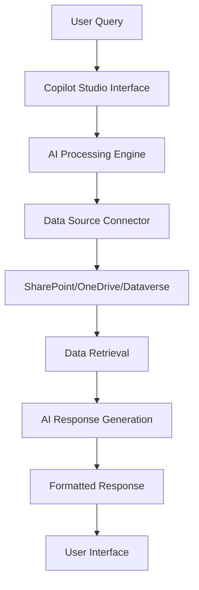

# Chat with Your Data using Copilot Studio

## Introduction

This document provides comprehensive guidance for implementing a chat-with-your-data solution using Microsoft Copilot Studio. This low-code approach enables organizations to create intelligent conversational experiences that can interact with their proprietary data sources without extensive custom development.

## Solution Overview

Microsoft Copilot Studio is a low-code platform that allows users to build, customize, and deploy AI-powered chatbots and copilots. The solution enables natural language interactions with organizational data through a user-friendly interface that requires minimal technical expertise.

### Business Value

- **Accelerated Time-to-Market**: Deploy intelligent data interaction capabilities in days rather than months
- **Reduced Development Costs**: Leverage low-code approach to minimize custom development requirements
- **Enhanced User Experience**: Provide intuitive natural language access to complex datasets
- **Scalable Architecture**: Built on Microsoft's enterprise-grade infrastructure
- **Compliance Ready**: Inherits Microsoft's security and compliance frameworks

## Data Flow



1. User submits natural language query through the copilot interface
2. Copilot Studio processes the query using built-in AI capabilities
3. System identifies relevant data sources and retrieves information
4. AI engine generates contextual response based on retrieved data
5. Formatted response is presented to the user

## Configuration Instructions

### Prerequisites

- Microsoft 365 subscription with Copilot Studio licensing
- Power Platform environment with appropriate permissions
- Data sources (SharePoint, OneDrive, Dataverse, or supported connectors)
- Global Administrator or Power Platform Administrator role

### Step 1: Environment Setup

1. **Access Copilot Studio**
   - Navigate to [https://copilotstudio.microsoft.com](https://copilotstudio.microsoft.com)
   - Sign in with your organizational credentials
   - Select your Power Platform environment

2. **Verify Licensing**
   - Ensure Copilot Studio licenses are assigned to users
   - Confirm AI Builder credits are available for enhanced functionality

### Step 2: Create a New Copilot

1. **Initialize Copilot**
   - Click "Create" in the Copilot Studio home page
   - Select "New copilot"
   - Choose "Skip to configure" for manual setup
   - Provide a meaningful name and description

2. **Configure Basic Settings**
   - Set the copilot name: `[Your Organization] Data Assistant`
   - Description: `AI assistant for querying organizational data`
   - Language: Select primary organizational language
   - Icon: Upload organizational branding if desired

### Step 3: Data Source Configuration

1. **Add Knowledge Sources**
   - Navigate to "Knowledge" tab in your copilot
   - Click "Add knowledge"
   - Select appropriate data source type:
     - **SharePoint**: For document libraries and lists
     - **OneDrive**: For individual file access
     - **Dataverse**: For structured business data
     - **Web**: For public websites or documentation

2. **SharePoint Configuration**
   ```
   Source Type: SharePoint
   Site URL: https://[tenant].sharepoint.com/sites/[sitename]
   Authentication: Use organizational identity
   Scope: Select specific document libraries or entire site
   File Types: Word, Excel, PowerPoint, PDF, Text
   ```

3. **Data Indexing**
   - Allow 15-30 minutes for initial indexing
   - Monitor indexing status in the Knowledge section
   - Verify successful indexing before proceeding

### Step 4: Conversation Design

1. **Topics Configuration**
   - Navigate to "Topics" tab
   - Review system topics (Greeting, Goodbye, Escalate)
   - Customize greeting message to explain data capabilities

2. **Custom Topic Creation**
   ```
   Topic Name: Data Query Handler
   Trigger Phrases:
   - "Show me data about"
   - "What information do you have on"
   - "Search for"
   - "Find documents related to"
   ```

3. **Generative AI Configuration**
   - Enable "Generative answers" feature
   - Set content moderation level to "Medium" or "High"
   - Configure response length preferences
   - Enable citation display for source attribution

### Step 5: Security and Authentication

1. **Authentication Setup**
   - Navigate to "Settings" > "Security"
   - Configure authentication:
     ```
     Authentication Type: Microsoft Entra ID
     Restrict Access: Only users in my organization
     User Assignment: Assign specific users or groups
     ```

2. **Data Access Permissions**
   - Ensure users have appropriate SharePoint/OneDrive permissions
   - Configure least-privilege access principles
   - Test access with different user roles

### Step 6: Testing and Validation

1. **Test Conversation**
   - Use the built-in test panel
   - Submit various query types:
     - Simple fact-finding: "What is our return policy?"
     - Complex queries: "Show me sales data from Q3 2024"
     - Document searches: "Find contracts mentioning vendor X"

2. **Response Quality Validation**
   - Verify accuracy of retrieved information
   - Check citation links are functional
   - Confirm appropriate handling of sensitive data

### Step 7: Deployment

1. **Publication Settings**
   - Navigate to "Publish" tab
   - Select deployment channels:
     - **Microsoft Teams**: For organizational chat integration
     - **Power Pages**: For web portal embedding
     - **SharePoint**: For intranet integration
     - **Custom website**: Using provided embed code

2. **Teams Integration**
   ```
   Steps:
   1. Click "Teams" in channels section
   2. Configure app details and branding
   3. Submit for admin approval if required
   4. Install in target Teams environments
   5. Test functionality within Teams interface
   ```

### Step 8: Monitoring and Maintenance

1. **Analytics Setup**
   - Enable analytics in Copilot Studio
   - Monitor key metrics:
     - User engagement rates
     - Query success rates
     - Most common query types
     - Error frequencies

2. **Content Updates**
   - Establish regular review cycles for knowledge sources
   - Update indexed content as organizational data changes
   - Monitor and address user feedback

## Glossary

- **Copilot Studio**: Microsoft's low-code platform for building AI-powered conversational experiences
- **Knowledge Sources**: Data repositories that the copilot can query and retrieve information from
- **Generative AI**: AI capability that creates human-like responses based on retrieved data
- **Citations**: References to source documents that support generated responses
- **Topics**: Conversation flows that handle specific types of user interactions
- **Power Platform**: Microsoft's suite of low-code/no-code business application tools

## References

- [Microsoft Copilot Studio Documentation](https://docs.microsoft.com/en-us/microsoft-copilot-studio/)
- [Power Platform Admin Center](https://admin.powerplatform.microsoft.com/)
- [Microsoft 365 Compliance Center](https://compliance.microsoft.com/)
- [SharePoint Online Documentation](https://docs.microsoft.com/en-us/sharepoint/)
- [Microsoft Teams Platform Documentation](https://docs.microsoft.com/en-us/microsoftteams/platform/)
